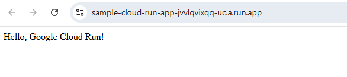

## terraform-cloud-run

---

### Project Structure
```plaintext
terraform-cloudrun-project/
├── terraform/
│   ├── main.tf                # Defines Cloud Run deployment infrastructure
│   ├── variables.tf           # Variables to make configuration reusable
│   ├── outputs.tf             # Outputs from the Terraform execution
│   ├── terraform.tfvars       # Actual values for project-specific variables
│   ├── .terraform.lock.hcl    # Auto-generated after `terraform init`
├── app/
│   ├── app.py                 # Sample Flask web app for the Cloud Run service 
│   ├── Dockerfile             # Instructions to create a containerized version of the app
├── README.md                  # Instructions and project overview
```

### Getting Started

#### Step 1: Clone the Repository
```bash
git clone <repository-url>
cd terraform-cloudrun-project
```

#### Step 2: Set Up necessary Variables
Edit the terraform.tfvars file to specify project ID, region & container_image(Optinal):
```json lines
project_id = "project-id"
region     = "us-central1"
container_image = "yalikhach/sample-flask-app:0.1" (Optional)
```
Edit the terraform.main file to specify a path to the File with a token
```json lines
credentials = file("~/<sample-flask-app-XXXX.json>")
```

#### Step 3: Initialize, Plan & Apply Terraform
```terraform
$ cd terraform/
$ terraform init
$ terraform plan
$ terraform apply
```
Type 'yes' when prompted to confirm the deployment.

#### Step 4: Get the Cloud Run URL
After applying the configuration, Terraform will output the URL of deployed service. Open this URL in browser to access the application:
```plaintext
Outputs:

cloud_run_service_url = "https://<auto-generated-cloud-run-url>"
```
The application should display:
```plaintext
Hello, Google Cloud Run! 
```
